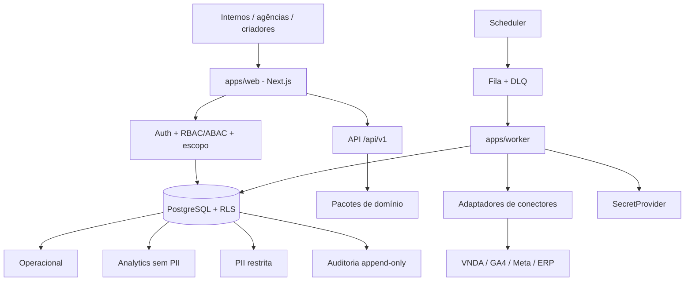
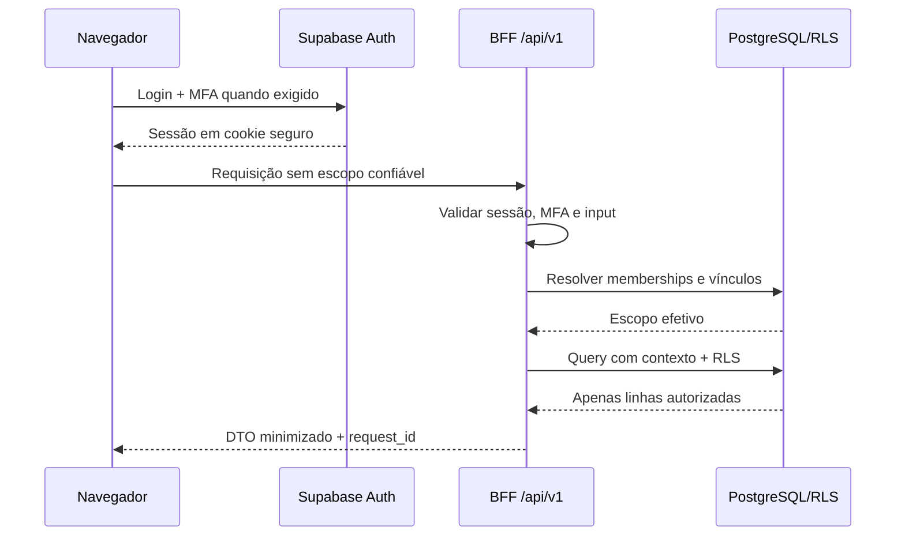

# Arquitetura

## Visão lógica

## Monorepo proposto

- `apps/web`: RSC, UI e BFF versionado.
- `apps/worker`: sincronização, reconciliação, agregação, comissão e exportação.
- `packages/auth`: sessão, permissões, políticas e resolução de escopo.
- `packages/database`: queries server-only, transações e tipos persistentes.
- `packages/connectors`: contratos e adaptadores mock/reais.
- `packages/analytics`: KPIs, atribuição, comissão e qualidade.
- `packages/config`: configuração validada por Zod e fronteira público/privado.
- `packages/ui`: tokens e componentes acessíveis.
- `packages/testing`: fixtures sintéticas e harnesses.

## Fronteiras de confiança

O navegador acessa apenas o BFF. O BFF resolve identidade, MFA, vínculos e permissões antes de executar queries sob RLS. A `service_role` pertence exclusivamente ao worker e a rotinas administrativas isoladas. O banco guarda referências de segredos, enquanto o valor é resolvido no cofre.

## Autenticação e autorização

## API

A API `/api/v1` terá autenticação obrigatória, schemas Zod, erros padronizados, `request_id`, paginação, ordenação por allowlist, rate limit e OpenAPI. IDs de escopo enviados pelo cliente serão intersectados com o escopo efetivo da sessão.

## Performance e cache

Dashboards usam agregações diárias, paginação e índices por escopo/data. Cache restrito inclui organização, marca, identidade/permissões, período e versão do dado na chave. Materialized views serão introduzidas somente mediante evidência de volume.

