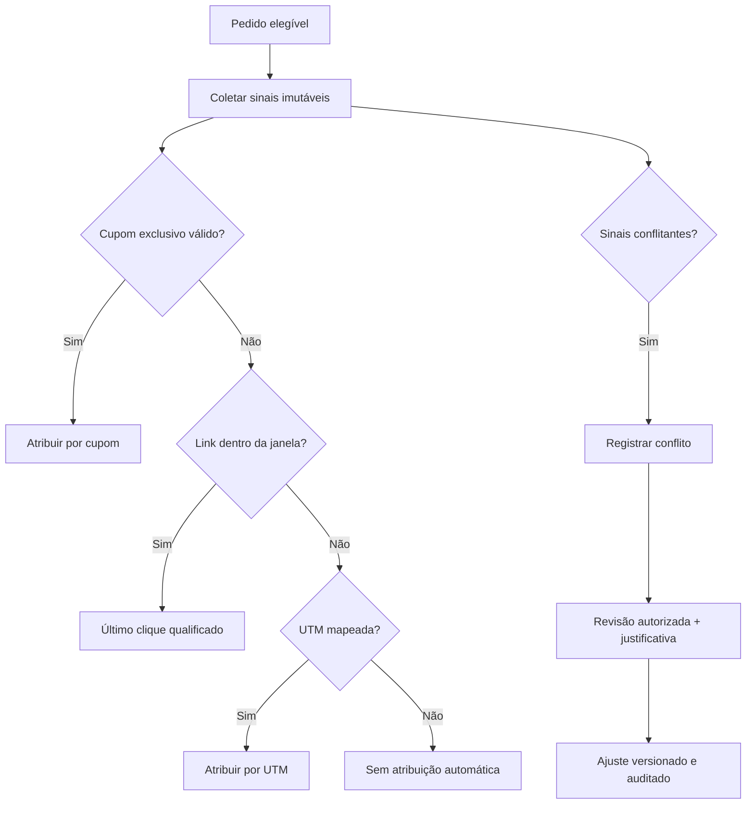

# Regras de atribuição

## Processo

## Regras iniciais

1. Cupom exclusivo válido no instante da compra.
2. Link individual dentro da janela configurada por campanha ou marca.
3. UTM mapeada para criador e campanha.
4. Ajuste manual somente por usuário autorizado.

Cupom conflitante com link vence comercialmente na versão inicial, mas ambos os sinais e o conflito são preservados. Para múltiplos links, aplica-se o último clique qualificado. Nenhuma quantidade fixa de dias fica no código.

## Versionamento

Cada atribuição registra versão da regra, sinais considerados, janela, timestamps, resultado e motivo. Reprocessamento cria nova decisão e não apaga a anterior.

## Comissão

Atribuição não implica elegibilidade. O ledger usa estados pendente, elegível, aprovada, bloqueada, cancelada, paga e estornada. Cancelamento/devolução cria crédito ou débito compensatório; nunca remove o lançamento original.

