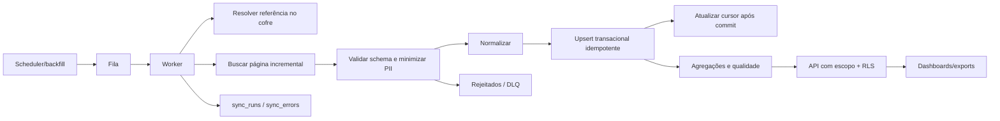

# Fluxo de dados

## Garantias

- Entrega ao menos uma vez; efeitos exatamente uma vez são aproximados por constraints, chave de idempotência e transação.
- Cursores só avançam depois do commit dos dados correspondentes.
- Um lock lógico impede a mesma integração e janela de executar concorrentemente.
- Payload inválido não contamina tabelas normalizadas.
- Contagens de recebidos, processados, ignorados e rejeitados são persistidas.
- Backfills não substituem silenciosamente históricos e são auditados.

## Reconciliação

Valores de cada fonte são preservados. A fonte oficial do KPI é escolhida no dicionário; diferenças geram `data_quality_issues` e nunca são ajustadas automaticamente para coincidir.

