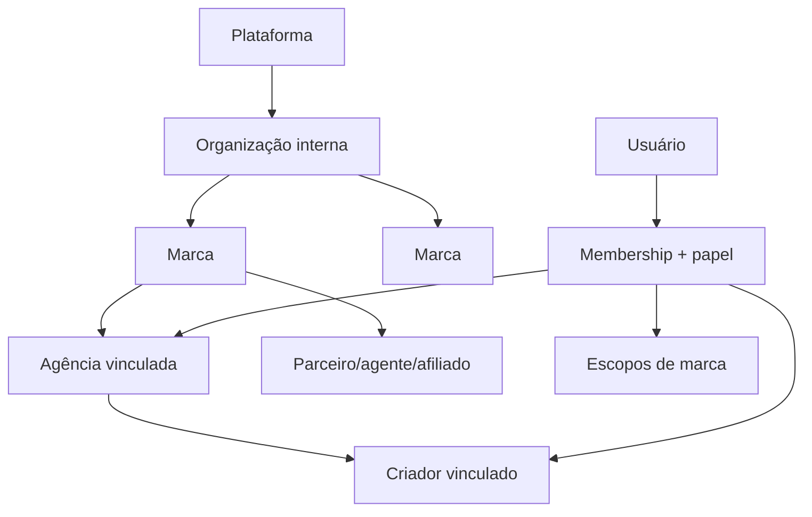

# Modelo de dados

## Hierarquia organizacional

## Agregados

- Identidade: `organizations`, `brands`, `user_profiles`, `memberships`, `membership_brand_scopes`, `roles`, `permissions`, `role_permissions`.
- Parceiros: `agencies`, `creators`, `agency_creator_links`, `partner_profiles`, `partner_brand_links`.
- Campanhas: `campaigns`, `campaign_creators`, `content_assets`, `tracking_links`, `tracking_clicks`, `coupons`, `coupon_assignments`, `campaign_goals`.
- Comércio: `commerce_sources`, `customers`, `products`, `product_variants`, `orders`, `order_status_history`, `order_items`, `refunds`, `payments`, `inventory_snapshots`.
- Atribuição: `attribution_signals`, `order_attributions`, `attribution_conflicts`, `manual_attribution_adjustments`.
- Financeiro: `commission_rules`, `commission_ledger`, `payout_batches`, `payout_items`.
- Métricas: entidades de anúncios e tabelas diárias de anúncios, web, produtos e canais.
- Operação: conexões, cursores, execuções, erros, webhooks e qualidade.
- Segurança: auditoria, eventos, exports e revisões de acesso.

## Invariantes

- UUIDs aleatórios e FKs sem cascatas destrutivas.
- Pedido único por `(source_id, external_order_id)`; usuário externo recebe outro identificador público aleatório.
- Valores monetários em `bigint` de centavos e moeda ISO; percentuais/precisão excepcional em `numeric`.
- `timestamptz` em UTC, soft delete quando aplicável e histórico imutável para finanças.
- Toda entidade operacional contém apenas os IDs de escopo pertinentes; não se adicionam colunas vazias sem significado.
- PII fica isolada e não é propagada para tabelas analíticas.
- Índices começam por escopo seletivo e incluem data/status conforme os padrões de consulta.

